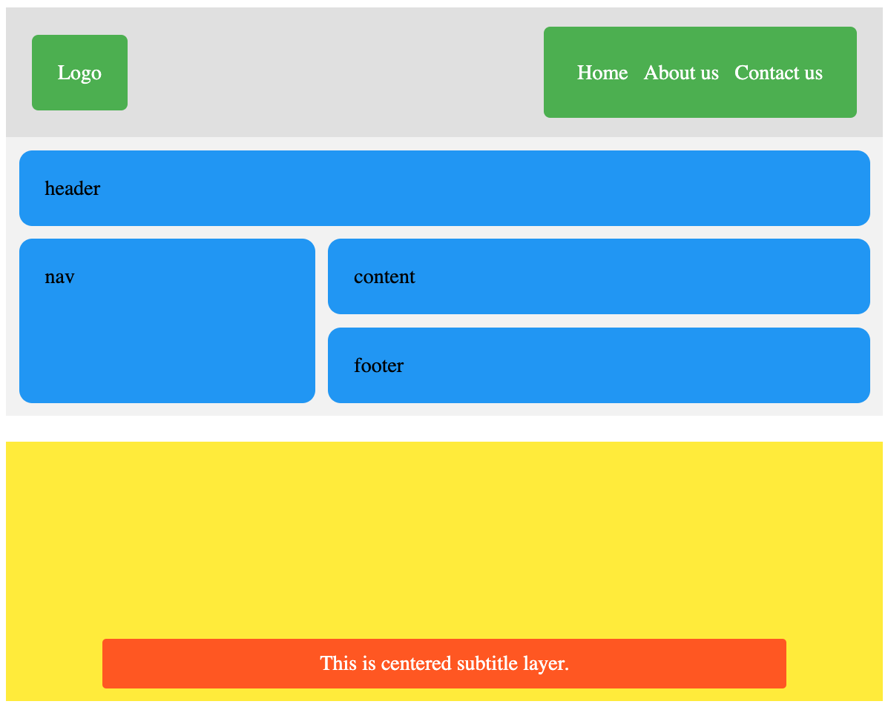
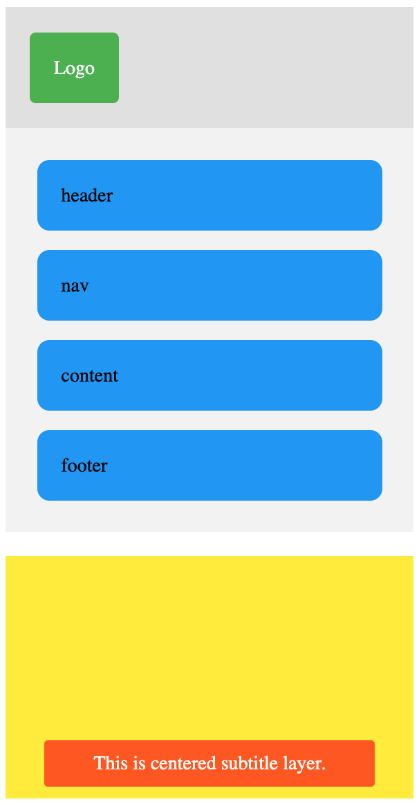

### CS472-Homework-02-CSS
#### Exercise 01
Create a parent block element `
`, that acts as a container, and contains a child block element `
`.
* Style the parent `
` element with a visible border, and 500px height;
* Style the child `
` element with a visible border, and 200px width and height;
* Center the child `
` element horizontally and vertically within the parent `
` element

Note: Explore different strategies to solve this exercise.

#### Exercise 02
Write your CSS code within the provided `styles.css` file to match the following designs for large and small screens (do not edit the HTML file):

